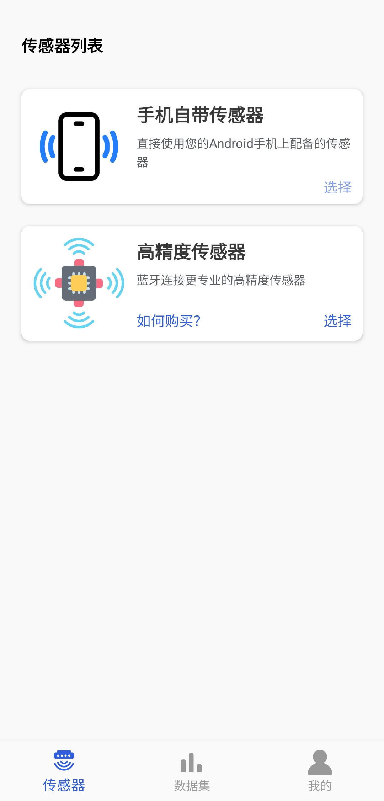
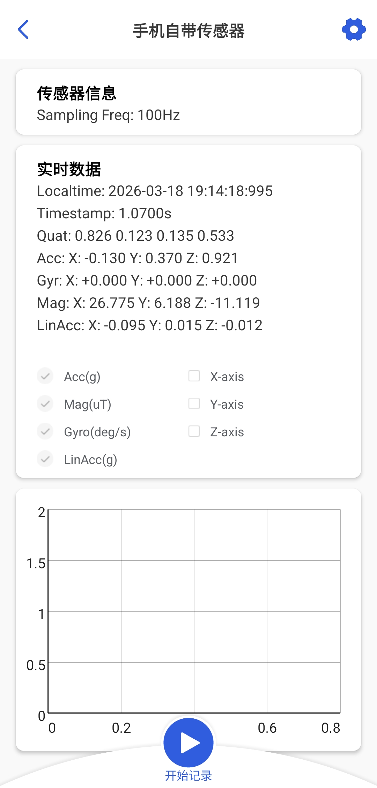
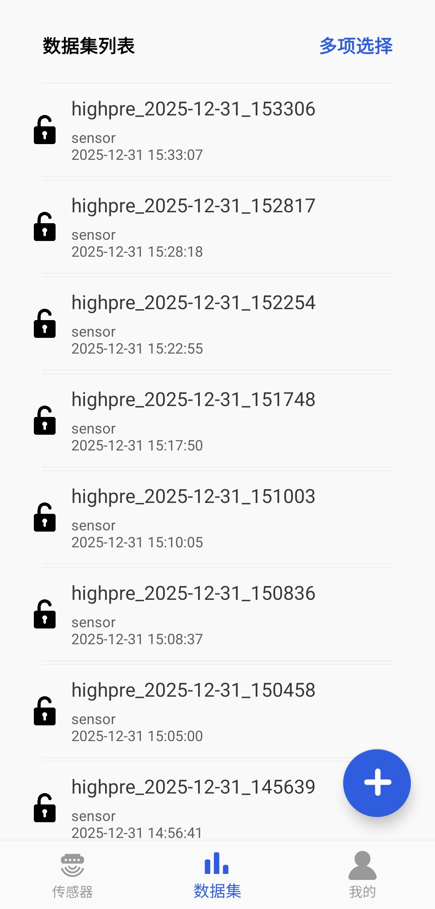
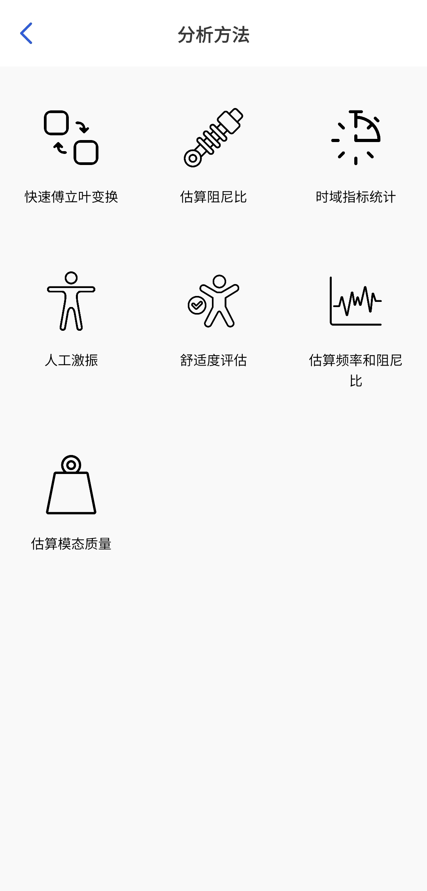
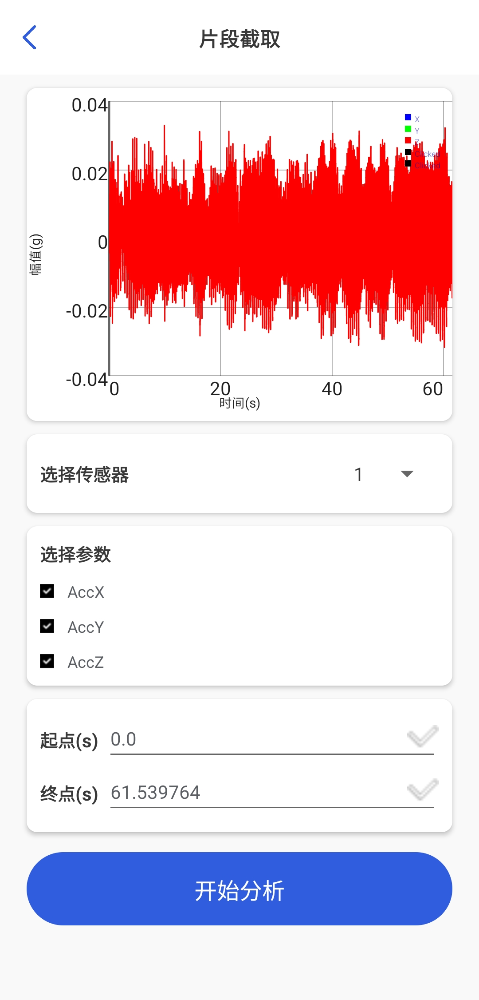
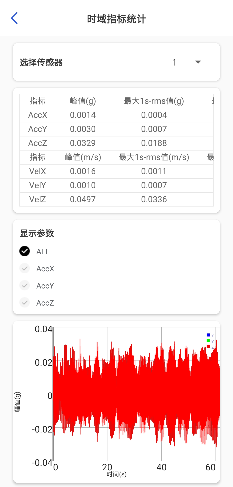

# **TJVIB_APP**
A professional vibration DAQ and analysis platform.

## Features
Collecting data from LpmsB2 or built-in sensor

Local or Cloud data storage (Cloud version using MySQL database with Redis enabled)

Muilt-usage analysis feature (eg. Time-domain metrics, Frequency, Amplitude, Damping ratio)

## Runtime Screenshots

## Tech Stack
Java, MySQL, Redis, Spring, JNI, C++

## Note
Lastest version won't be released to public.
